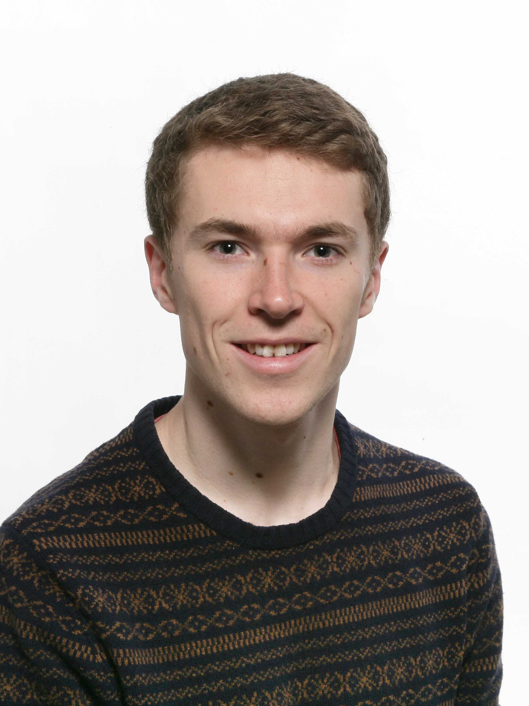

{:style="display: block; width: 200px; height:auto; margin-left: auto; margin-right:40px; float: left;"}
I'm a PhD student at the University of Cambridge, supervised by [Dr Daniel Cole](https://blogs.ncl.ac.uk/danielcole/) and [Prof. Mike Payne](http://www.tcm.phy.cam.ac.uk/profiles/mcp1/) on methods for accurately simulating organometallic proteins. Current research interests include:
* linear-scaling density functional theory
* methods for treating strong correlation such as DFT + U and dynamical mean field theory
* the oxygen-evolving centre of photosystem II
