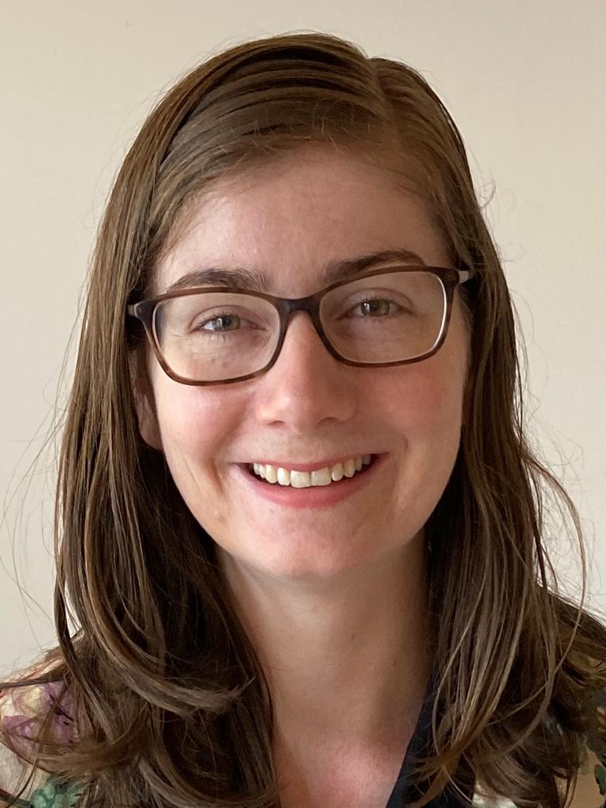

{:style="display: block; width: auto; height:350px; margin-left: auto; margin-right:40px; float: left;"}
I am a Post-Doc in the Ecology and Evolution of Plant Sexual Systems Group with [Prof. John Pannell](https://www.unil.ch/dee/pannell-group) at UNIL in Lausanne, Switzerland. I'm currently looking the at evolution of dioecy from hermaphroditism comparing transitions via gynodioecy to those via monoecy.

I am a also Reasearch Associate (postdoc level) in the group of [Prof. Bill Lee](https://www.landcareresearch.co.nz/about-us/our-people/william-lee) in the Ecosystems & Conservation group at Manaaki Whenua - Landcare Research, Dunedin, New Zealand. We have been examining genomic downsizing in the New Zealand flora and it's ecological consequences. 

Current research interests include:
   * lineage diversification in plants
   * biome shifts
   * ecological outcomes of whole genome duplication
   * evolution of the New Zealand flora
   * threatened plant ecology

I completed my PhD at the University of Otago, supervised by [Prof. Bill Lee](https://www.landcareresearch.co.nz/about-us/our-people/william-lee), [Assoc. Prof. David Orlovich](https://www.otago.ac.nz/botany/staff/davidorlovich.html), [Prof. Steven Higgins](http://www.bayceer.uni-bayreuth.de/pfloek/de/mitarbeiter/mit/mitarbeiter_detail.php?id_obj=141103), and [Dr. Matt Larcombe](https://www.otago.ac.nz/botany/staff/mattlarcombe.html) on the effect of biome shifts on lineage diversification in plants. 

<a class="twitter-timeline" data-height="600" href="https://twitter.com/estheraceae?ref_src=twsrc%5Etfw">Tweets by estheraceae</a> 

