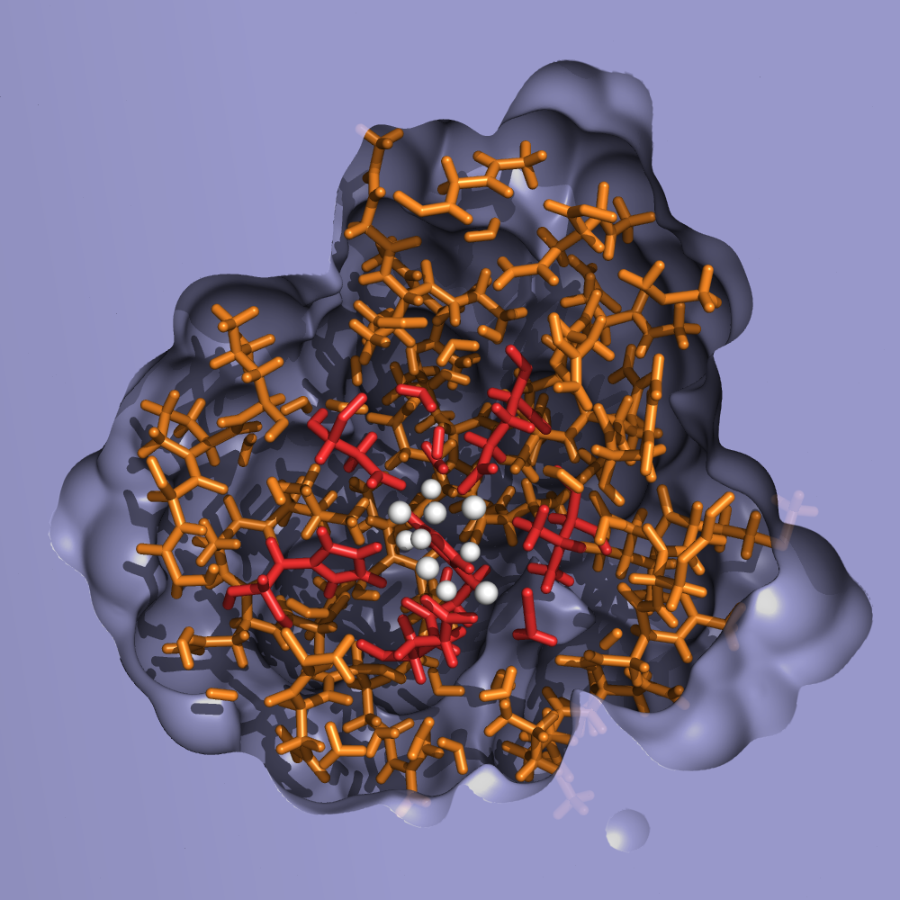

## In English...
I am interested in photosystem II (PSII), a protein found in algae, cyanobacteria, and higher plants. Within PSII lies the oxygen-evolving complex (OEC), a cluster of four manganese atoms and a calcium atom. The OEC is responsible for converting water into oxygen gas - a key step in photosynthesis. However, the precise oxygen-formation mechanism is not fully understood. My research involves performing computer simulations of the OEC in an attempt elucidate some of the details surrounding this reaction.

There are two main challenges to doing so. Firstly, our current go-to method for simulating materials at the atomistic scale is density functional theory, or "DFT". But standard DFT struggles with more than several hundred atoms. I use so-called "linear-scaling" DFT to allow me to simulate the thousands of atoms that make up PSII.

The second challenge is due to the manganese atoms. The electrons belonging to these atoms are in such tight confines that they interact with one another exceptionally strongly --- so strongly, in fact, that DFT struggles to model their behaviour. To overcome this I develop and use more complicated techniques called DFT + U and dynamical mean field theory.

## Research areas

### Photosystem II

> Computational model of the oxygen evolving complex (white), with surrounding protein (red/orange) and implicit solvent (blue)

More to come soon...
